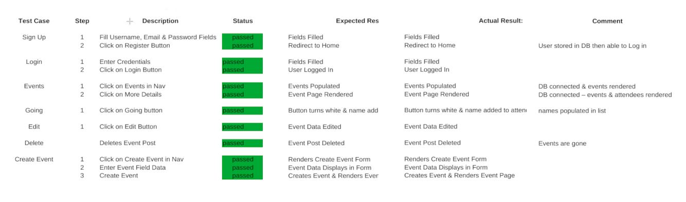

# Welcome to SocialZr

Our team employed agile deployment methodology in the creation of this application. From Inception, through Planning to Execution we aimed to be constantly deploying new updates and features. Workflow and delegation was done based on each developer's unique skill-sets and helped us maintain workflows and schedules based on our client's needs.

## Testing 

## Available Scripts

In the project directory, you can run:
1. npm i
2. npm start
